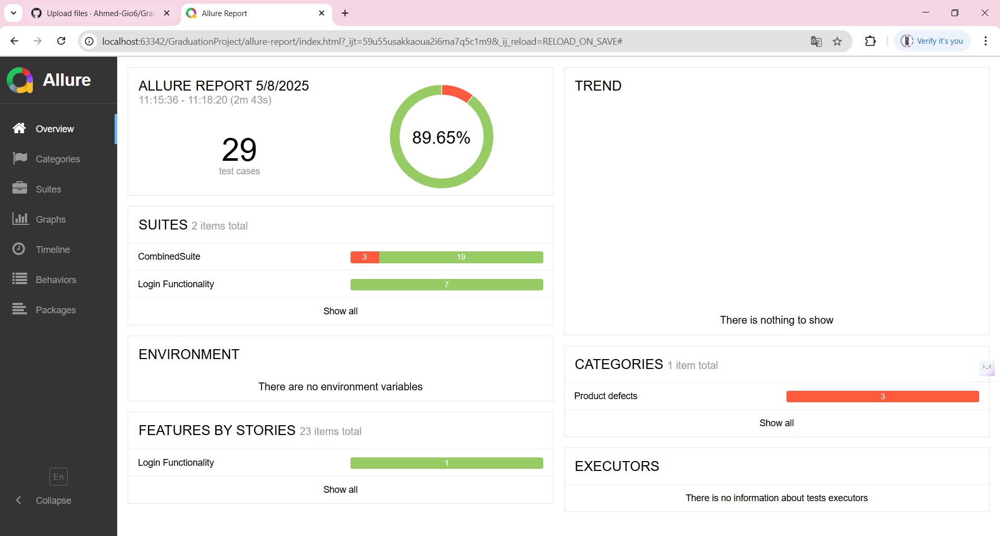
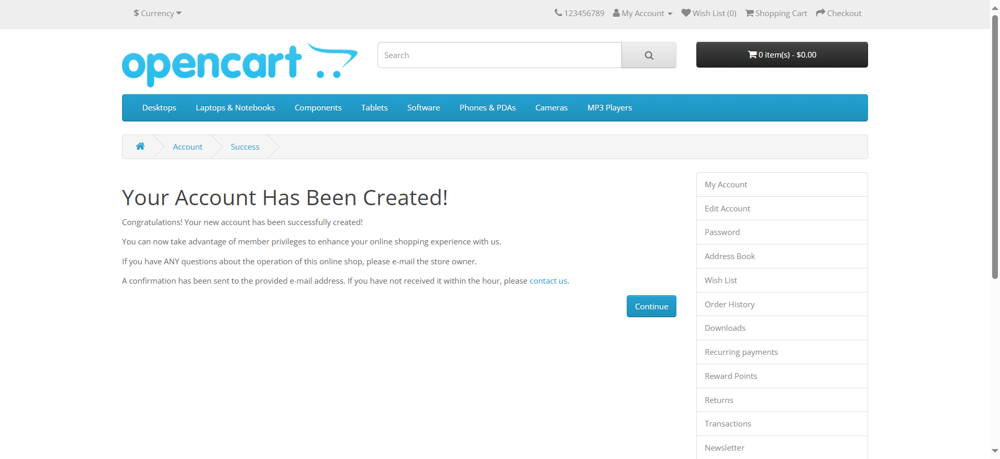

🧪 Graduation Project – UI Automation Testing

This project is a UI Test Automation Framework built using TestNG and Cucumber to automate test scenarios on the following demo site:

🔗 Demo Site – OpenCart

---
✅ Features

⚙ Automated UI Testing using TestNG

🧾 BDD-style Scenarios implemented with Cucumber

📸 Screenshots are captured automatically on test failure

📊 Allure Reports for rich and interactive test result visualization

🗂 Clean Project Structure with readable and maintainable code

🧪 Test Cases Report (Excel) & 🐞 Bugs Report (Excel) are included

---

## *Tested Features*

| Feature             | Status  | Framework  | Screenshot on Fail | Cucumber Used |
|---------------------|---------|------------|---------------------|----------------|
| *Registration*     | ✅ Done | TestNG      | ✅                   | ❌              |
| *Login*            | ✅ Done | Cucumber    | ✅                   | ✅              |
| *Add to Cart*      | ✅ Done | TestNG      | ✅                   | ❌              |
| *Add to Wishlist*  | ✅ Done | TestNG      | ✅                   | ❌              |
| *Contact Us*       | ✅ Done | TestNG      | ✅                   | ❌              |

---

---

🧪 Test Scenarios Covered

🐾	✅ Test Case

⿡	📝 Register New Account
⿢	🔐 Login with Valid Credentials
⿣	🛒 Add Item to Cart
⿤	💖 Add Item to Wishlist
⿥	✉ Contact Us Form Submission

---

🧬 Technologies Used

☕ Java

🌐 Selenium WebDriver

🧪 TestNG

🥒 Cucumber (BDD)

📊 Allure Report

⚙ Maven

---

🧾 Project Structure

├── GraduationProject/
│   ├── features/               # Cucumber feature files
│   ├── stepDefinitions/        # Step definitions
│   ├── runners/                # TestNG runners
│   ├── utils/                  # Utilities (like screenshot logic)
│   └── Screenshots/           # Failure screenshots
├── allure-results/             # Allure raw results
├── allure-report/              # Generated Allure report
├── target/                     # Maven target folder
└── README.md

---

📸 Screenshot on Failure

Whenever a test case fails, a screenshot is captured automatically and saved in the Screenshots/ folder.

---

📊 Allure Reports

To generate and view the Allure Report, run the following:

allure serve

The report includes:

✅ Test summaries

🧩 Detailed step execution

📷 Failure screenshots

🌍 Environment details

---

📁 Documentation

✅ Test Cases Report (Excel)

🐞 Bugs Report (Excel)

---

📷 Sample Screenshot

---

🧠 Author

Ahmed Saad
Coding Instructor@iSchool  | Software Testing Engineer | Passionate about Automation Testing | Computer Science Engineer – Menoufia University
